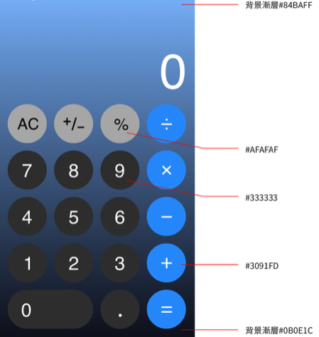

# Practice Calculator Modal

## Description
- 點擊按鈕時彈出計算機。
- 點擊計算機以外介面可關閉計算機。
- 顯示最多九個數字 (不包含符號字元)。

- 電腦版
  - 計算機 modal 可在畫面上拖拉移動
    - 拖曳可超出螢幕，但 x 與 y 最少依然會留 20px。
    - 當點擊任何功能按鍵時，無法拖曳。
  - 計算機寬度固定為 480px
    - 當畫面小於 768px 時，計算機寬度改為 360px
- 手機版
  - 彈出後固定在畫面最下方。
  - 寬度為畫面 100%，高度最大為畫面50%，計算機 modal 可 scroll。

## UI
